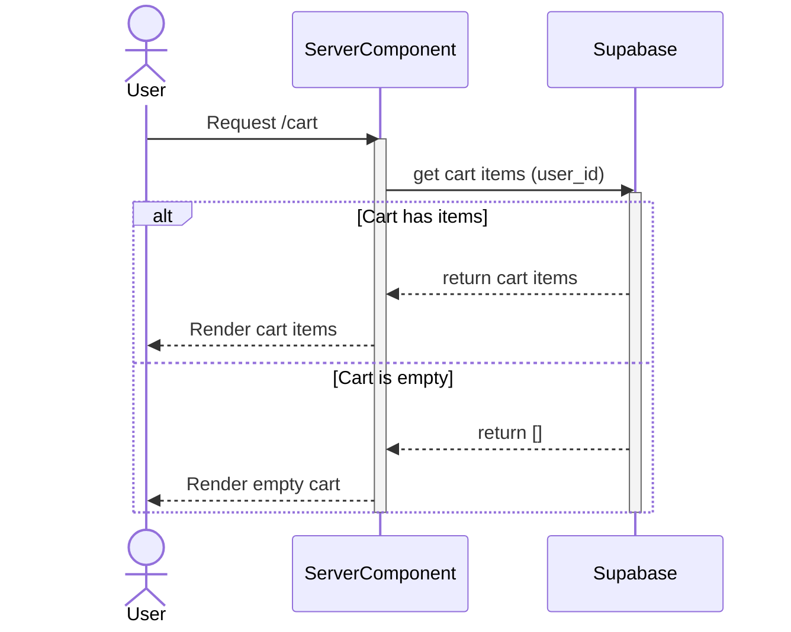

## Render Cart items

```mermaid
sequenceDiagram
    actor User
    participant ServerComponent
    participant Supabase

    User->>ServerComponent: Request /cart
    activate ServerComponent

    ServerComponent->>Supabase: get cart items (user_id)
    activate Supabase

    alt Cart has items
        Supabase-->>ServerComponent: return cart items
        ServerComponent-->>User: Render cart items
    else Cart is empty
        Supabase-->>ServerComponent: return []
        ServerComponent-->>User: Render empty cart
    end

    deactivate Supabase
    deactivate ServerComponent
```

