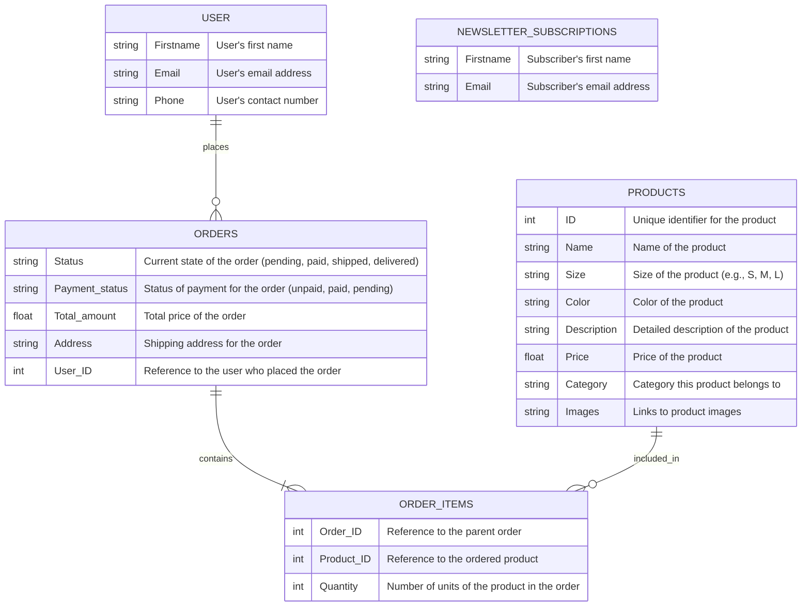

## Tables
### Products

* ID: Unique identifier for the product
* Name: Name of the product
* Size: Size of the product (e.g., S, M, L)
* Color: Color of the product
* Description: Detailed description of the product
* Price: Price of the product
* Category: Category this product belongs to
* Images: Links to product images

### User

* Firstname: User's first name
* Email: User's email address
* Phone: User's contact number

### Orders

* Status: pending, paid, shipped, delivered — Current state of the order
* Payment status: unpaid, paid, pending — Status of payment for the order
* Total amount: Total price of the order
* Address: Shipping address for the order
* User ID: Reference to the user who placed the order

### Order Items

* Order: Reference to the parent order
* Product: Reference to the ordered product
* Quantity: Number of units of the product in the order

### Newsletter Subscriptions

* Firstname: Subscriber's first name
* Email: Subscriber's email address

## ERD

